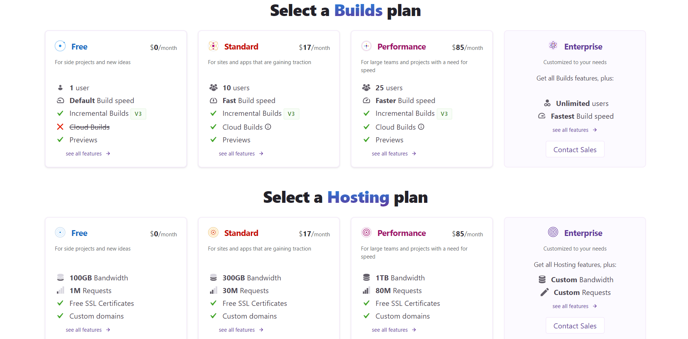

A few days ago at GatsbyConf 2021, Gatsby announced a pretty cool new service: hosting on Gatsby Cloud. Along with that announcment, they are currently running a promotion for the month of March where anyone who hosts their site on Gatsby Cloud (for free) can recieve a $15 coupon for the Gatsby store. That means those of us who attended GatsbyConf this year and missed out on getting some free swag still have an chance to get that sweet free t-shirt, hat, socks, or even pajama bottoms! I'll go into more detail below, but for those of you who just want to head staight to the deal, [here is the link](https://www.gatsbyjs.com/hosting-swag/).

## Gatsby Cloud hosting

Previously, gatsby cloud was only a tool for building gatsby sites. They offered really fast build times and, in April of last year, released incremental builds which sped things up even further. For many gatsby devs, faster build times don't really matter that much, but for devs creating sites that might requred multiple builds a day, Gatsby Cloud was a big improvment.

Now, instead of taking those builds to another host, you have the option to host your site directly on Gatsby Cloud. Gatsby's new hosting service is powerd by [Fastly's](https://www.fastly.com/) edge network, so your site should be blazingly fast all over the world. Gatsby Cloud also offers a generous free tier so it might be a real competitor for more established static site hosting solutions like [Netlify](https://netlify.com) (which I am a giant fan of).

## The Deal

Now for the part you're really here for: free swag. Here's what you have to do:

First, if you don't already have a gatby cloud account, sign up for one [here](https://www.gatsbyjs.com/dashboard/signup/). You can sign up with your github account which is convenient since that's likely how you are going to be deploying your site to Gatsby Cloud anyway.

Next, add a site. You can choose to either create a new one from a template, or connect to an existing repository. Currently, Gatsby Cloud supports [github](https://github.com) and [gitlab](https://gitlab.com).

Finally, add a custom domain to the site you've created. You cannot get the deal with the provided gatsbyjs.io domain that they provide you. If you don't have a domain ready to go for your project, I've had good experiences with both [namecheap](https://namecheap.pxf.io/WDDDkM) and [google domains](https://domains.google/).

Once you've got your site up and running on Gatsby Cloud, you can head [here](https://www.gatsbyjs.com/hosting-swag/), fill out the form, and you should recieve your coupon. Remember this deal is only happening during March, so use that for motivation to get that gatsby project you've been putting off done. Personaly, this deal motivated me to finally get this personal website up and running.
