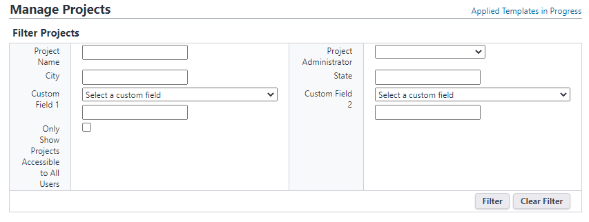
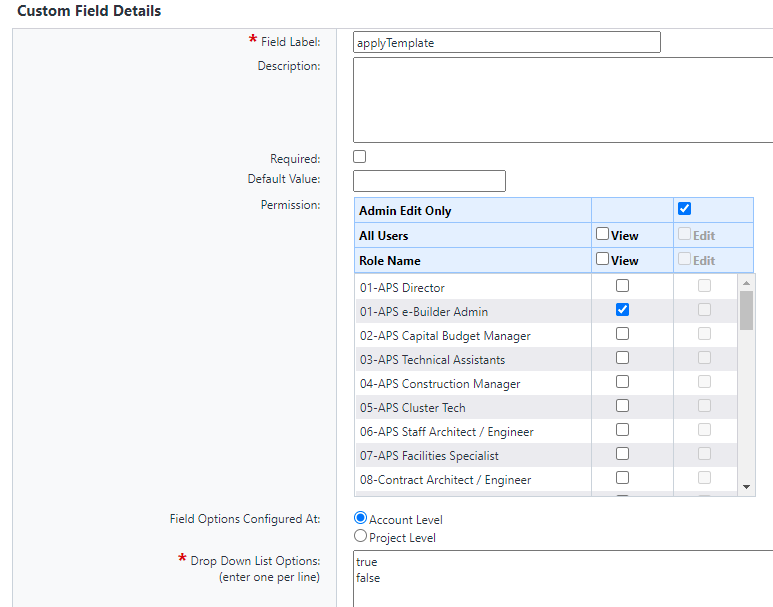
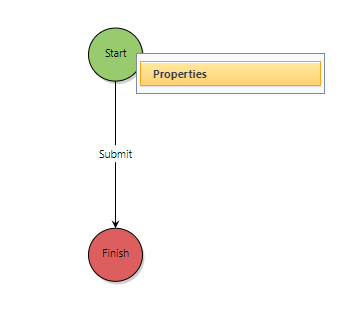
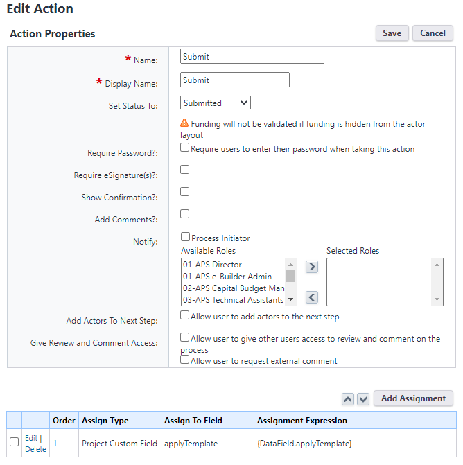
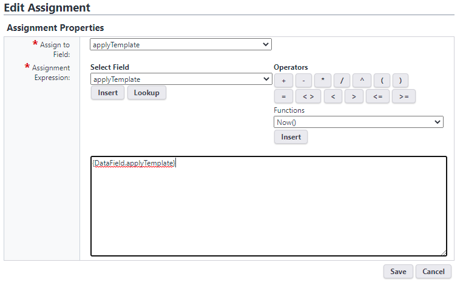
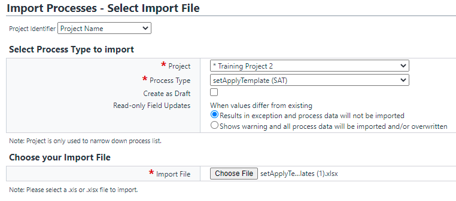
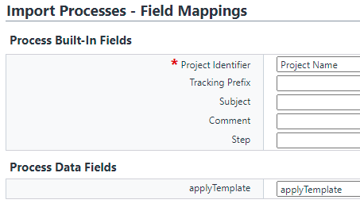
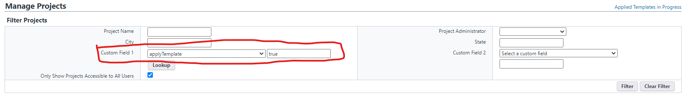

The manage projects screen in the [e-Builder](https://e-builder.net) admin tools can be a powerful tool for making changes to many projects at once. The filter, however, leaves much to be desired. Currently, you can only filter by project name, project administrator, city, state, projects accessible to all users, and two custom fields. Sometimes this is enough for the task at hand, but I have wanted more granular control to make changes to a very specific group of projects. The existing filters don't provide for that level of granularity. In this post I'll show you a way around the limitations of the existing filter that will give you all of the granularity you could possibly want using custom fields, reports, and process imports.

So how does this all work, you might ask? Well, we're going to be creating a custom field on the project details which we can set to true or false depending on whether or not we want to make changes to that project. In the manage projects screen we will be able to filter by that custom field. The value of the field will be set using a field assignment on a very simple process. We can use e-Builder reports to generate a list of projects we want to modify which we can use as the input for a process import which will set that custom field on all of those projects using the field assignment. I'll take you through it step-by-step.

## Setup

### 1. The Custom field

The first thing we're going to do is create the custom field on the project details. Head to "Global Custom Fields" in the admin tools. Add a new field on the "Project" type. Choose the "Drop Down List" data type. I called my field `applyTemplate`, but you can call it anything that makes sense to you. Set the field to admin edit and view only. Add `true` and `false` options. Save your new field.

### 2. The Process

Next, we will create the process that will set the value of the field we just created. Head to Manage Processes and create a new process. I called my process `setApplyTemplate`, gave it the prefix `SAT`, and made it active.

Now, head to the data tab and add a new field to the process. This field should mirror the field you created earlier, so mine was again called `applyTemplate` and was a drop down field with options `true` and `false`.

Next, I created a page layout with the one field we've created and set it to the default actor and non-actor layout. This step isn't strictly neccesary, but it might help you out later if you need to do any debugging.

Finally, we'll set up the workflow. This will probably be the most simple workflow you ever work on as we won't actually be adding any additional steps. We're just going to add a field assignment on the submit action. To do so, open up the workflow designer.

Open the properties of the "Start" step.

Edit the "Submit" action. Press the "Add Assignment" button.

In the "Assign to Field" field, choose the field you created _on the project details_. Next, in the "Assignment Expression" field, choose the field you created _on the process_. Press "Insert". Your assignment should appear as below.

Now, save the field assignment, save the action properties, save the step, then save and publish the workflow. Great! Now we're done getting it set up. Let's get to using it!

## Using the system we've created

### 1. Creating the Report

The first thing you will do is create a report. This is where you are going to be filtering for the projects that you want to apply templates to or do bulk edits on. This is also why this technique is so great. You have the full power of e-Builder reporting at your hands. Use whichever reporting module you want, though I would strongly suggest using BI reports as it's a bit easier to deal with for this use case.

Create a report like the table below: with one column for the project name and another called applyTemplate with the value you want to set the applyTemplate custom fields to. If you want, your report can just be a list of project names and you can add the second column manually in excel after exporting it from e-Builder.

| Project Name | applyTemplate |
| ------------ | ------------- |
| Project 1    | true          |
| Project 2    | true          |
| Project 3    | true          |
| Project 4    | true          |
| Project 5    | true          |

### 2. Importing the Processes

Now you should be ready to import processes. Head to the processes tab and click on "Import Processes" in the upper-right. Select setApplyTemplate as the process type and upload the excel file that you generated.

Hit next and make sure your project identifier and process data field are both correctly mapped. If your column names match the names of your fields, it should be mapped automatically, but you can map it manually if you need to.

Click next, make sure the preview row looks correct, and then click import.

### 3. Using our system to filter projects

Phew! Now we're finally to the part where you can use this thing! Head back to "Manage Projects" in the admin tools. All you need to do now is choose your `applyTemplate` custom field in either custom field drop down and enter the value `true`. Press the filter button and, hey presto, you have just filtered in ways you could not before. You can apply templates and bulk edit to your heart's content.

### 4. Cleanup

After you've done your bulk work, there is still some cleanup to do. You should either modify the existing excel file you've created rerun your report with `false` in the second column and then import that just as you did before. If you don't do this, all the projects you just filtered for will be mixed in with the ones you filter for next time. This import file should look like the one below.

| Project Name | applyTemplate |
| ------------ | ------------- |
| Project 1    | false         |
| Project 2    | false         |
| Project 3    | false         |
| Project 4    | false         |
| Project 5    | false         |

Alternatively, you could just run a report on all projects and use that to set every project's applyTemplate field to false. You'll be initiating a lot of process instances at once if you do this, however, and if your account is on US Region 1, I'm going to blame you next time e-Builder gets slow 😉.

## Conclusion

Using this method will grant you much more control in doing bulk operations on projects in e-Builder. I hope it helps improve your e-Builder admin exprience. If you have any questions, feel free to contact me using [the form on my homepage](/) or send me a message on [Linkedin](https://www.linkedin.com/in/haackr/).
